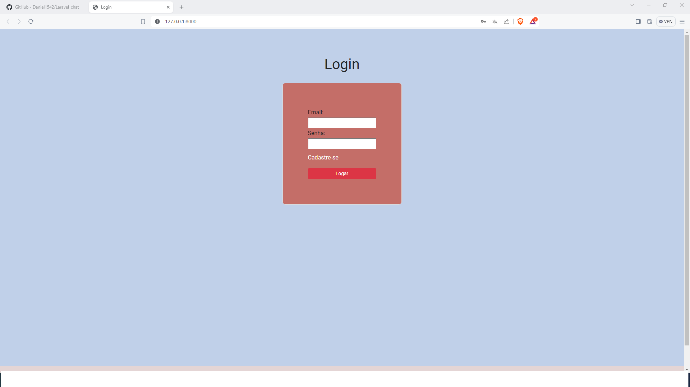
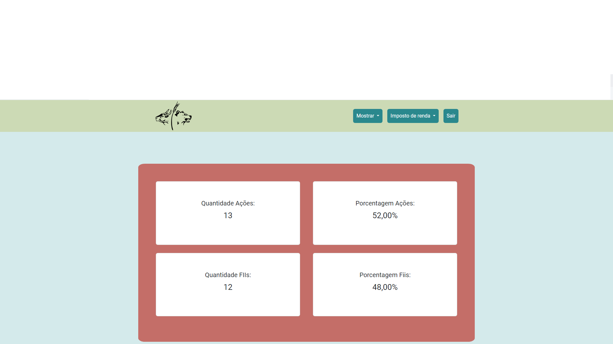
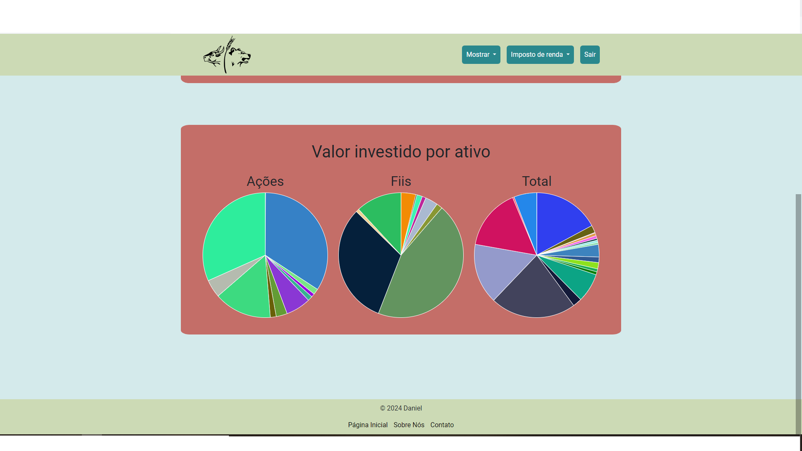
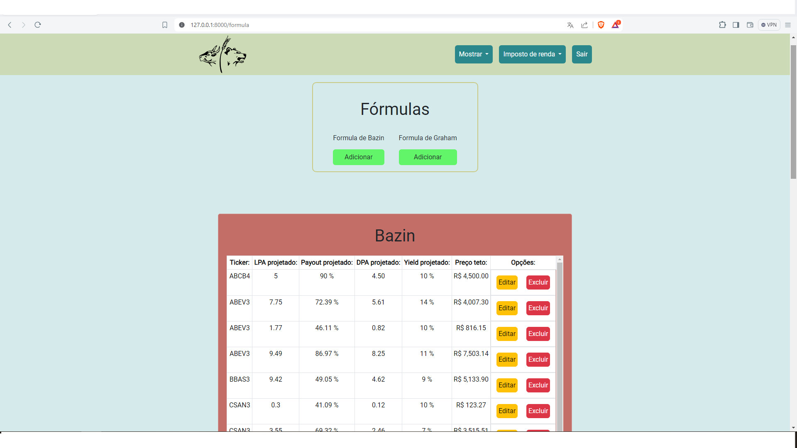
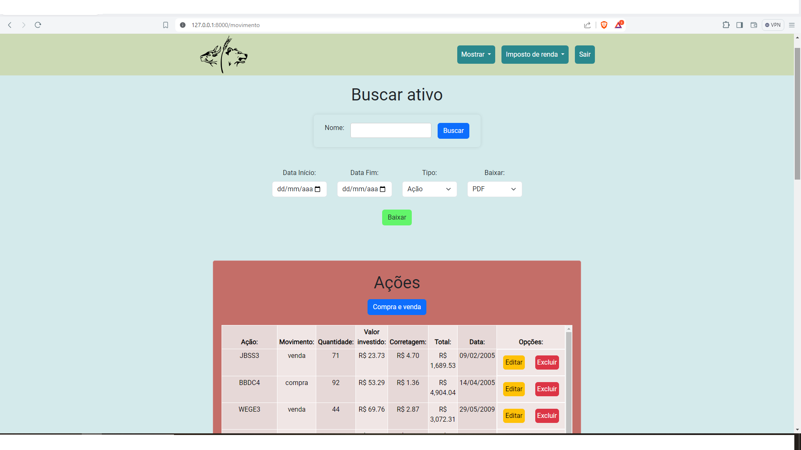
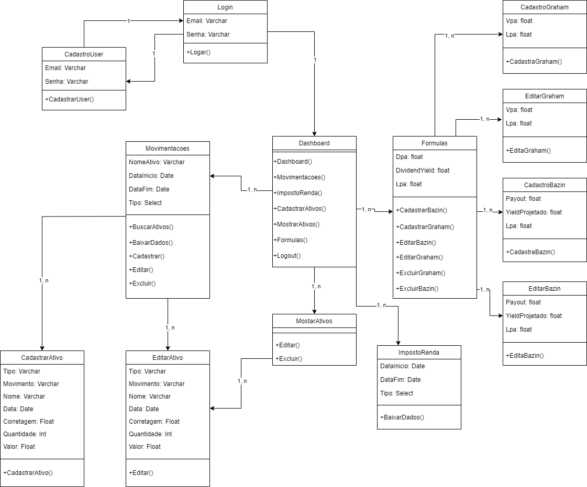
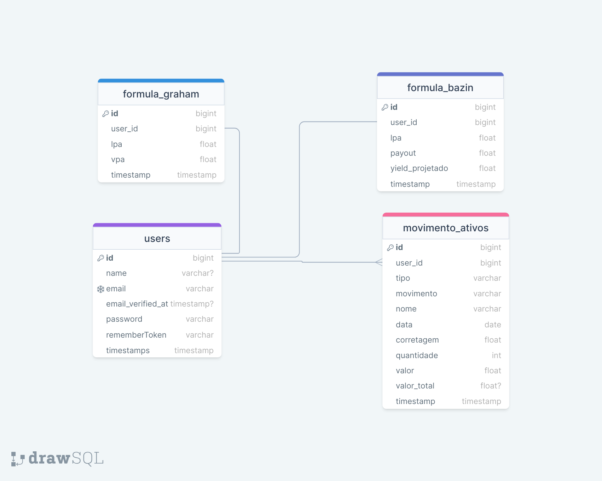

## Gerenciador de ações e fundos imobiliários.

Este projeto é um site para auxiliar na declaração de imposto de renda de ações e fundos imobiliários.

### Recursos Principais

- Framework Laravel
- Bootstrap
- BLADE
- CSS
- PHP
- Javascript
- Jquery
- Banco de dados SQL
- Api rest
- Code Sniffer
- PhpUnit
- Vue.js
- Opção de baixar dados em formato Excel e PDF

### Instalação

1. Clone o repositório.
2. Execute `composer update`.
3. Crie um arquivo `.env`.
4. Copie o arquivo `.env.example` para `.env` e ajuste as configurações, como a conexão com o banco de dados.
5. Execute `php artisan key:generate`.
6. Inicie o banco de dados.
7. Execute `php artisan migrate --seed` para criar as tabelas no banco de dados com as migrações e sementes.

### Uso

- Execute `php artisan serve` para iniciar o servidor local.
- Execute `npm run build` para iniciar o Vue.js.
- Acesse o aplicativo em http://localhost:8000.
- Faça a conexão com a api pelo postman se quiser testar a api rest.
- É possivel também utilizar Docker.

### Screenshot

### Diagramas

## Contribuição

Sinta-se à vontade para contribuir com melhorias ou relatar problemas.

## Licença

O framework Laravel é um software de código aberto licenciado sob a [licença MIT](https://opensource.org/licenses/MIT).
