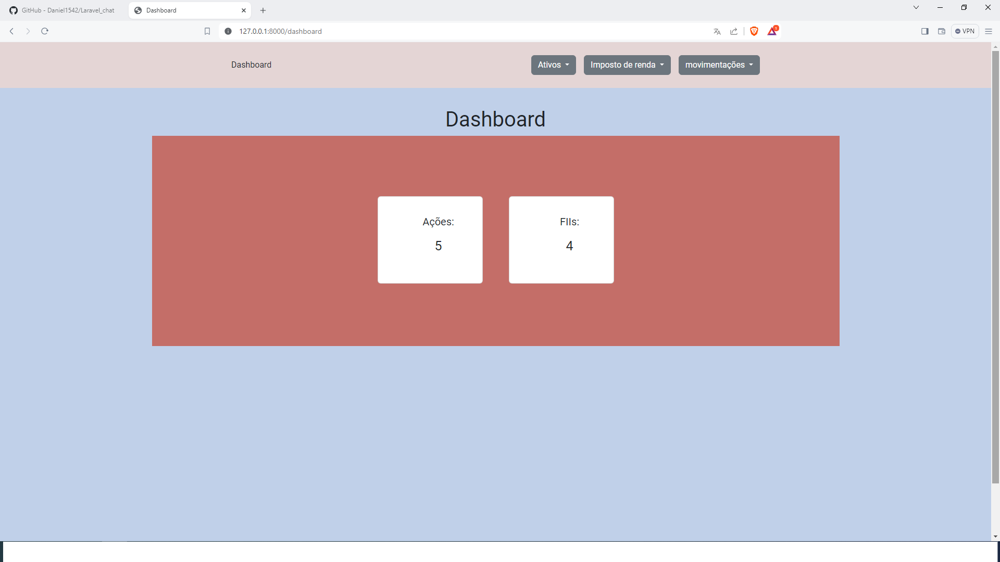
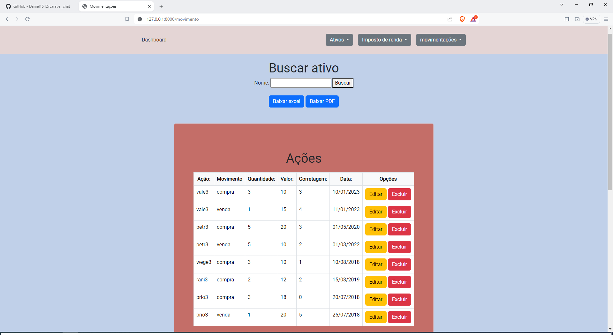

## Gerenciador de ações e fundo imobiliários

Este projeto é um site ainda em desenvolvimento para auxiliar na declaração de imposto de renda de ações e fundos imobiliários.

### Recursos Principais

- Framework Laravel
- Bootstrap para o design responsivo
- BLADE
- CSS
- PHP
- Javascript para fazer ajax
- Banco de dados SQL
- Api rest
- Code Sniffer
- phpUnit
- Laragon
- CRUD (Create, Read, Update, Delete)
- Opção de baixar dados em formato Excel e PDF

### Instalação

1. Clone o repositório.
2. Execute `composer install`.
3. Crie um arquivo `.env`.
3. Copie o arquivo `.env.example` para `.env` e ajuste as configurações, como a conexão com o banco de dados.
4. Execute o Laragon para iniciar o banco de dados.
5. Execute `php artisan migrate --seed` para criar as tabelas no banco de dados com as migrações e sementes, se aplicável.

### Uso

- Execute `php artisan serve` para iniciar o servidor local.
- Acesse o aplicativo em http://localhost:8000.
- Faça a conexão com a api pelo postman se quiser testar a api rest.

## Contribuição

Sinta-se à vontade para contribuir com melhorias ou relatar problemas.

## Licença

O framework Laravel é um software de código aberto licenciado sob a [licença MIT](https://opensource.org/licenses/MIT).
